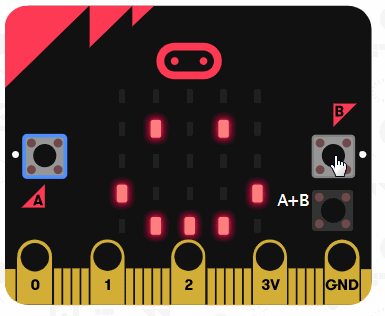
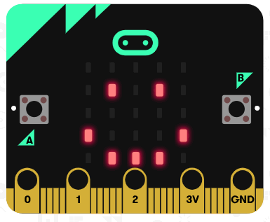

# LittleRedFlower 小红花

## 版本说明

### V0.03 20190903

当前版本主要增加双用户及游戏功能，可同时支持大宝和二宝记录，并可在单个用户达到100个以上后，激活隐藏游戏功能，支持两个玩家对局。

> 以下功能只有当积分（小红花个数）达到 100以上才会开启，若积分低于100（未达到或抵扣积分后少于），将无法启动游戏功能。

长按A+B键5秒以上，进入游戏选择界面，再按A或B键进行光标移动，再次按A+B键进行选择。游戏编码、游戏名称及兑换积分对照表如下：

| 游戏编号 |  游戏名称  | 兑换积分（每次） |
| :------: | :--------: | :--------------: |
|    1     | 石头剪刀布 |        --        |
|    2     |   掷色子   |        --        |

操作步骤：

1. 满足游戏开启条件（积分>100）；
2. 按下`A+B`键5秒以上，屏蔽将会显示数字0（若未出现0，则只需要短按`A+B`键即可），即表示进入了游戏选择界面；
3. 按下`A`键游戏编码递增，按下`B`键，游戏编码递减；
4. 根据上表选择相应的游戏编号，然后按`A+B`键确认，即可进入游戏。

游戏操作说明：

1. A键和B键分别由一名玩家操控；
2. 按一次A键或按一次B键，便显示当前玩家得分；
3. A+B键用于查看比分；
4. 长按A+B键5秒以上退出当前游戏。

### V0.02 

系统启动后默认显示笑脸，当前计数为0，若此时按下B键，则显示苦脸。

当按下A键后，计数自增1，小红花闪烁1次，同时显示当前计数总和1，再按一次A，则计数再次自增1，小红花闪烁2次，并显示当前计数总和2，此时按下B键，则重复显示上述过程。

`当前存在问题：连续点击A键，则将正常计数（按下次数），但将逐个过程显示，而不是直接按最后一次结果进行显示。`
